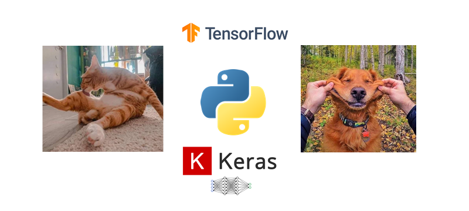
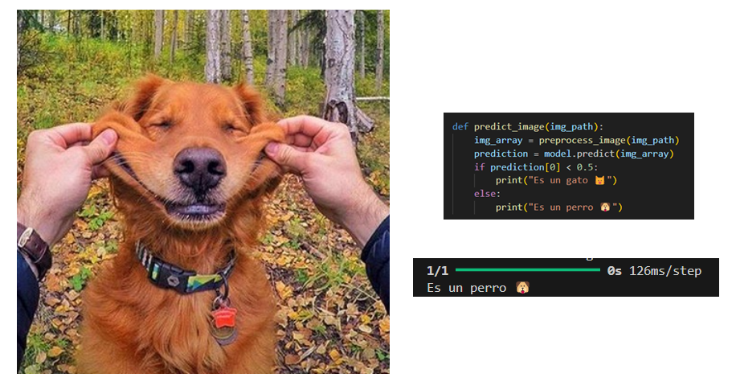
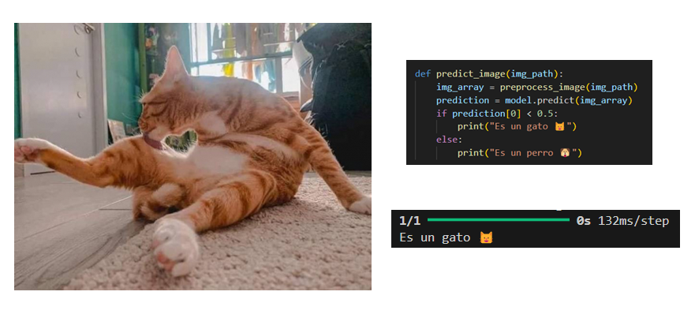

<h1 align="center"> FelipedelosH </h1>
<br>
<h4>ML - CNN - CAT&DOG</h4>


<br>
:construction: Status of project :construction:
<br><br>
A Convolutional Neural Network (CNN) based project to classify images of cats and dogs using Python, Keras, and TensorFlow. This repository includes data preprocessing, model architecture, training, and evaluation scripts to achieve high accuracy in image classification tasks.


## :hammer:Funtions:

- `Function 1`: Read all train images en dataset/train & dataset/validation.<br>
- `Function 2`: Clasify new cat&dog image in two clases<br>


## :play_or_pause_button:How to execute a project

```
python -m venv myenv
```

Activate virtual env:

```
myenv\Scripts\activate
```

install dependencies:

```
pip install pandas
pip install tensorflow
pip install keras
pip install scikit-learn
```

Execute:

1 - if not have model.keras file then exexute:
```
0_create_train_neuralnetwork.py
```

2 - if you hav model.keras select a cat&dog pic in file:

```
predictor.py
```






## :hammer_and_wrench:Tech.

- Python
- TensorFlow
- Keras
- PIL

## :warning:Warning.

- NOT UPLOAD complete dataset. download here: 
https://www.kaggle.com/datasets/shaunthesheep/microsoft-catsvsdogs-dataset?resource=download

## Autor

| [<br><sub>Andrés Felipe Hernánez</sub>](https://github.com/felipedelosh)|
| :---: |